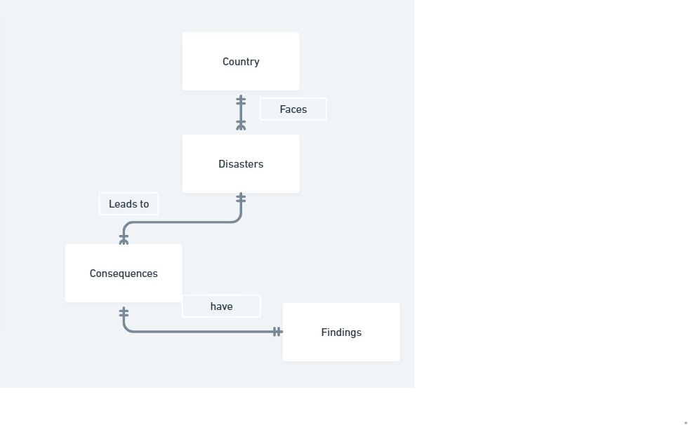

# **Global Warming Impact Analysis: A Yearly Disaster and Country-Level Database**

**By:** Abu Bakar Imran

**Video Overview:** <https://youtu.be/ZNXqWfox9is?si=Xm24GnO-Sjkbw4y7>

---

## **Scope**

The purpose of this database is to explore the effects of global warming on different parts of the world.
It documents how disasters occur in various countries, the cities affected, the consequences, and a year-by-year summary for the last decade, highlighting the increasing severity of events.

**In Scope:**

* Countries and their cities affected by disasters.
* Disaster details, scale, and impact on populations.
* Consequences (environmental, social, economic).
* Yearly summaries to compare disaster frequency, intensity, and impact trends.

**Out of Scope:**

* Root causes of global warming such as CO₂ emissions or industrial pollution.
* Predictive climate modeling — the current focus is historical analysis.

---

## **Functional Requirements**

* Query by **country**, **city**, and **type of disaster** to analyze the impact of global warming.
* Compare yearly disaster data for a country or disaster type.
* Review consequences in environmental, social, and economic terms.
* Summarize yearly changes and trends for better understanding.
* Allow expansion to include causes of disasters and mitigation strategies in the future.

---

## **Representation**

### **Entities**

#### **Country**

* **Primary Key:** `country_id` (int)
* Attributes:

  * `name` (text)
  * `city` (text)
  * `total_population` (int)
  * `type_of_location` (text)
  * `latitude` (real)
  * `longitude` (real)
  * `place_affected` (int)

#### **Disaster**

* **Primary Key:** `disaster_id` (int)
* Attributes:

  * `type` (text)
  * `scale` (text/real)
  * `num_of_affected` (int)
  * `date` (date)

#### **Consequences**

* **Primary Key:** `conseq_id` (int)
* **Foreign Key:** `disaster_id`
* Attributes:

  * `environmental_impact` (text)
  * `social_impact` (text)
  * `economic_impact` (text)

#### **Findings**

* **Primary Key:** `findings_id` (int)
* **Foreign Key:** `disaster_id`
* Attributes:

  * `countries_yearly_comparison` (text)
  * `disaster_yearly_comparison` (text)
  * `impact_yearly_comparison` (text)
  * `global_warming_impact` (text)

---

## **Relationships**

* A **Country** can face one or many disasters.
* A **Disaster** can lead to one or many consequences.
* One **Consequence** is linked to one **Finding**.
* **Findings** summarize all related data for analysis.

---

## **Optimizations**

1. **Indexes:**

   * Index on `disaster.disaster_id` (used as a foreign key in `Consequences` and `Findings`).
   * Index on `countries.country_id` (used as a foreign key in `Disaster`).
   * Index on `Disaster.type` and `Disaster.scale` for frequent queries.

2. **Views:**

   * A `detailed_analysis` view combining data from **Country**, **Disaster**, **Consequences**, and **Findings** to simplify reporting and trend analysis.

---

## **Limitations**

* Data is being entered manually; automation and dataset integration will be added later.
* Current scope does not include greenhouse gas emissions or direct climate causes — focus is strictly on the severity and frequency of disasters due to global warming.
* Future improvements will include:

  * Charts and graphs via Python.
  * Larger datasets for more accurate trends.
  * Predictive analysis based on historical data.

---
